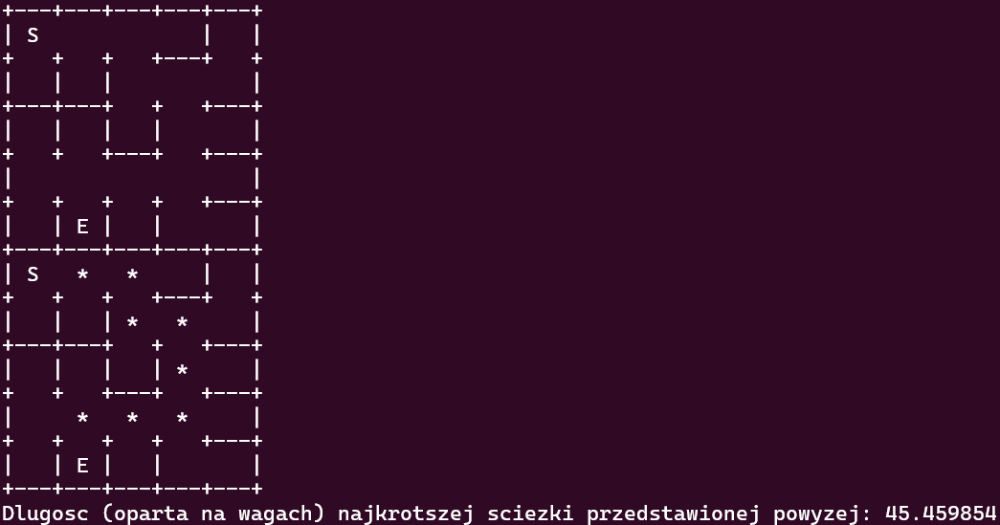
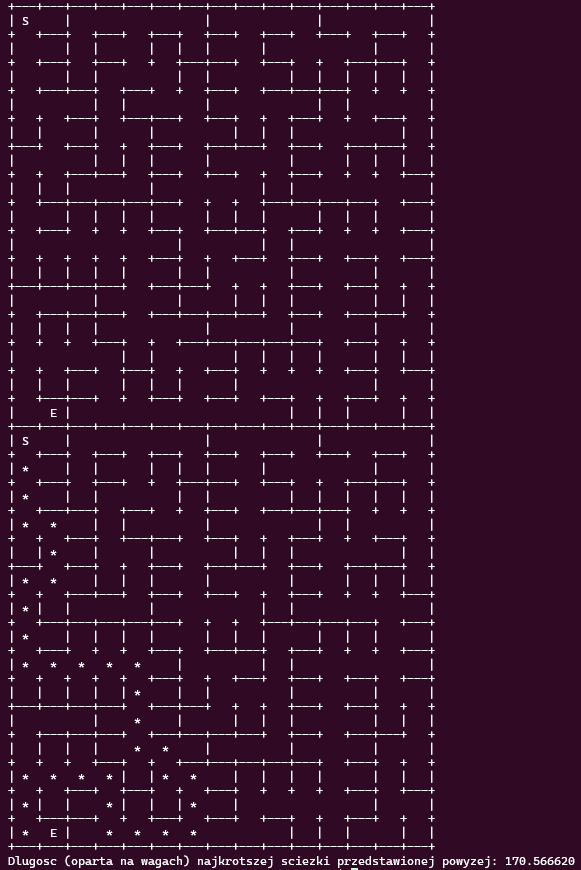
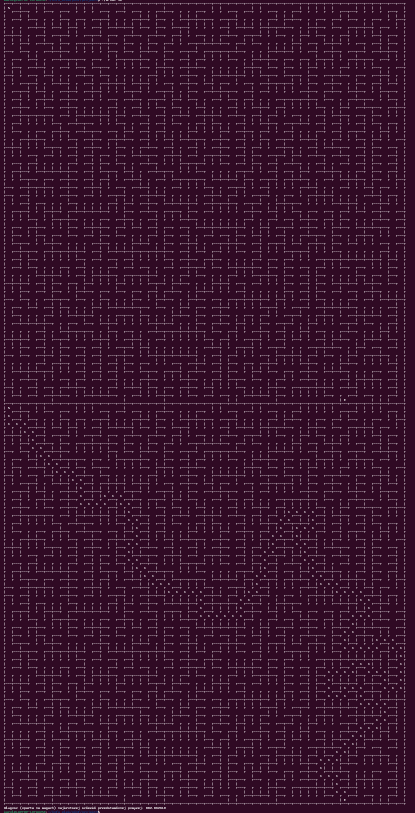

# Program labirynt.c:
- generuje losowy labirynt o wymiarach n x n (n podane jako argument wywołania programu)
- używa algorytmu DFS (depth-first search) do utworzenia labiryntu bez cykli
- traktuje każdą komórkę labiryntu jako wierzchołek grafu ważonego
- krawędziami tego grafu są przejścia między sąsiednimi komórkami (rozumiane jako brak ściany między nimi)
- każda krawędź ma losową wagę od 0.0 do 10.0
- używa algorytmu Dijkstra do znalezienia najkrótszej ścieżki między punktem startowym a końcowym ("najlżejszej" w kontekście wag krawędzi)
- wyświetla tekstową reprezentację labiryntu bez zaznaczonej ścieżki oraz z zaznaczoną najkrótszą ścieżką

## Wywołanie programu:
 (labirynt 5 x 5)

## Wizualizacja działania programu
 (5 x 5)

 (15 x 15)

 (50 x 50)

Jak widać, jedynym ograniczeniem programu jest tekstowa charakterystyka wizualizacji jego działania.
Dla dużych labiryntów ( > ~ 30) ciężko wyczytać najkrótszą ścieżkę w strukturze labiryntu.
